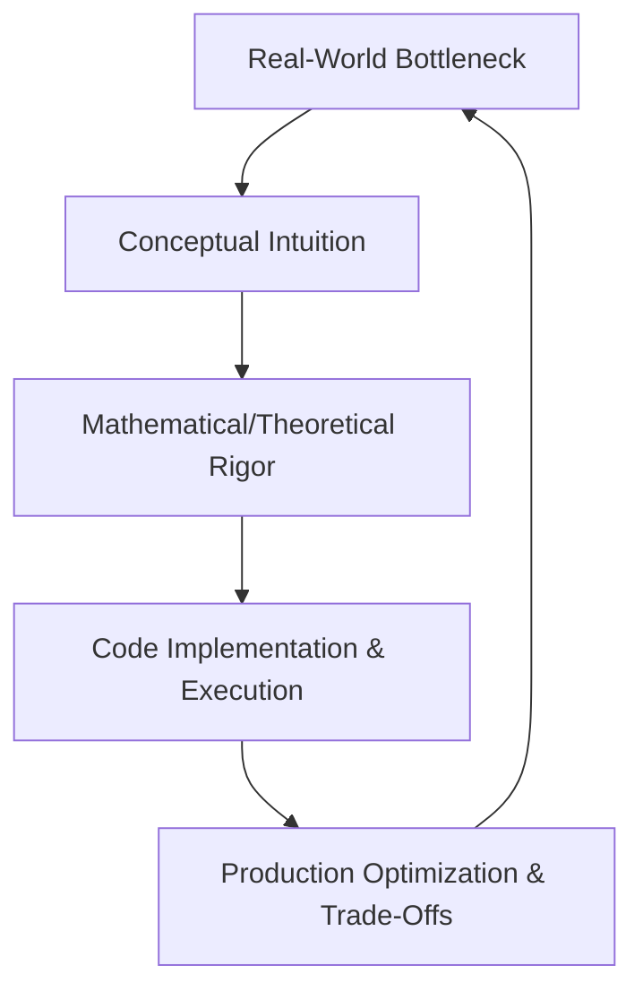

# Ascendrite Editorial Style Guide

This document is the master editorial standard and publishing constitution of the Ascendrite platform. Every contributor—whether human author, artificial intelligence agent, curriculum architect, editor, or reviewer—must adhere strictly to these guidelines.

---

## 1. Vision and Educational Philosophy

### Vision of Ascendrite
Ascendrite is a premium, open-access knowledge base designed to bridge the gap between academic theory, engineering practice, and professional readiness. The platform provides curriculum-driven, high-density learning paths across technical disciplines including Computer Science, Software Engineering, Artificial Intelligence, Data Science, Web Development, and Programming Languages.

### Educational Philosophy
Our educational philosophy rests on three pillars:
*   **Intuition Before Formalism:** Every concept must be motivated by a practical problem before introducing formal mathematical representations or complex code implementations.
*   **Rigorous Accuracy:** We do not simplify concepts to the point of introducing inaccuracies. We present the math, mechanics, and design trade-offs exactly as they exist in professional and academic environments.
*   **Industrial Alignment:** Learning must culminate in engineering execution. We teach topics not as abstract scholastic ideas, but as tools used to build, scale, and optimize real-world systems.

---

## 2. Learning and Writing Philosophy

### The Dual-Loop Learning Philosophy
Ascendrite utilizes a structured dual-loop pedagogy:
1.  **Conceptual Loop:** Translates high-level intuition into formal mathematical and theoretical models.
2.  **Practical Loop:** Translates theoretical models into executable, production-grade code and system architectures.



### Writing Philosophy: Knowledge Density
Our target is maximum information density with minimal narrative friction. Authors must avoid conversational fluff, patronizing introductions, and generic statements (e.g., "In this tutorial, we will learn..."). Instead:
*   Use precise, declarative language.
*   Present concepts through structured comparisons, visual representations, and step-by-step mathematical derivations.
*   Organize paragraphs around a single core technical point, followed immediately by code, equations, or diagrams.

---

## 3. Editorial Principles

*   **Platform and Language Independence:** The content must remain agnostic of specific web client renderers, code editors, or operating systems unless explicitly discussing platform-specific engineering (e.g., POSIX systems, web browser APIs).
*   **No Emojis:** The use of emojis is strictly prohibited across all content layers to maintain a professional, textbook-like aesthetic.
*   **Academic and Engineering Neutrality:** Maintain objective styling. Avoid declaring specific technologies or frameworks as "best" or "worst" without providing objective benchmark data, architectural trade-offs, or concrete historical context.

---

## 4. Tone and Voice

We write with the voice of an authoritative, encouraging, and deeply knowledgeable senior staff engineer or research professor.

| Attribute | Guideline | Example (Avoid) | Example (Prefer) |
| :--- | :--- | :--- | :--- |
| **Voice** | Active voice, placing actions on the systems or actors. | "The weights are adjusted by the gradient descent algorithm." | "Gradient descent minimizes the objective function by adjusting the model weights." |
| **Perspective** | Inclusive first-person plural ("we") to guide the reader, or objective third-person. | "You will notice that the loss decreases when you run the code." | "We observe that the loss decreases monotonically as optimization proceeds." |
| **Tone** | Precise, technical, and analytical. Avoid hype, exclamation marks, and emojis. | "Wow! LoRA is a super cool way to fine-tune massive models easily!" | "Low-Rank Adaptation (LoRA) reduces trainable parameters by factorizing weight updates." |
| **Formatting** | Clear, clean, structured lists and markdown tables. | Walls of unstructured text explaining multi-dimensional concepts. | Use comparison tables, labeled lists, and callout blocks. |

---

## 5. Pedagogical Progression (Beginner to Advanced)

Ascendrite uses a scaffolded approach to progressive disclosure. Every topic must guide a reader from baseline prerequisites to production implementation:

1.  **Contextual Orientation:** Define the problem statement, the system bottleneck, or the analytical challenge.
2.  **Visual Intuition:** Introduce diagrams or flowcharts showing the data pipeline or architectural layout.
3.  **Mathematical and Theoretical Foundation:** Provide the formal definition, mathematical derivations, or algorithmic pseudocode.
4.  **Reference Implementation:** Provide a clean, readable, and highly optimized code implementation.
5.  **Engineering and Scaling Challenges:** Discuss real-world bottlenecks, hardware constraints, time/space complexity, and production best practices.

---

## 6. Storytelling Philosophy in Technical Writing

To make technical content memorable and engaging, authors must use a "Problem-Driven Narrative Structure." Do not introduce concepts in a vacuum. Instead, structure the narrative as follows:

*   **The Conflict:** Establish a limitation. For example, why do recurrent networks fail to capture long-range sequences? (Vanishing gradient over deep time steps).
*   **The Conceptual Shift:** Introduce the breakthrough idea. (The introduction of constant error carousels and gating mechanisms in LSTMs).
*   **The Resolution:** Show how the new approach resolves the initial conflict, backed by comparative benchmarks and mathematical proofs.

---

## 7. Technical Writing Standards

### Vocabulary and Typography
*   **Code Elements:** Wrap variables, classes, functions, files, directories, API paths, and console commands in backticks (e.g., `git merge`, `main()`, `/path/to/project`).
*   **Key Terms:** Highlight important terms on their first occurrence using **boldface**. Do not italicize key terminology.
*   **Acronyms:** Define acronyms on first use, e.g., "Retrieval-Augmented Generation (RAG)."
*   **Formatting Math:** Always wrap inline mathematical expressions in single dollar signs (e.g., $x \in \mathbb{R}$) and block equations in double dollar signs (e.g., $$\mathbf{A}\mathbf{x} = \lambda\mathbf{x}$$). Use standard KaTeX/LaTeX formatting.

---

## 8. Chapter and Topic Organization

Each topic file (stored as structured JSON or Markdown) must follow this consistent layout:

```
# Subject Module: Topic Title
[Topic Metadata: Estimated hours, Prerequisites, Level]

## 1. Learning Objectives
* A list of 3-5 measurable outcomes using Bloom's Taxonomy verbs (e.g., Analyze, Derive, Design).

## 2. Introduction & Historical Context
* Short background framing the engineering challenge.

## 3. Theoretical Architecture / Mathematical Foundation
* Core formulas, proofs, diagrams, and explanations.

## 4. Reference Implementation
* Complete, documented code blocks with input/output examples.

## 5. Design Trade-Offs & Scaling
* Detailed analysis of time/space complexity, hardware constraints, and failure modes.

## 6. Revision & Synthesis
* Core takeaway concepts, quick reference equations, and review lists.
```

---

## 9. Cross-Topic Continuity and Terminology Consistency

To ensure the knowledge base functions as a unified textbook:
*   **Explicit Referencing:** Always reference prior topics by their ID and title (e.g., "As derived in machine-learning-m1-t1 (Linear Algebra), the orthogonal projection of a vector...").
*   **No Repetition:** Do not re-explain foundational concepts. Instead, link directly to the topic where the concept was introduced.
*   **Single Source of Truth (SSOT):** Terminology definitions must align with the centralized subject glossary (e.g., `knowledge-assets.json`). If a term is defined in one topic, it must be referred to using identical spelling and conceptual framework in all other topics.

---

## 10. Industry-First and Engineering-First Explanations

Our explanations are targeted at professional developers, research scientists, and system architects.
*   **Beyond Toy Examples:** Avoid using trivial datasets or simulated configurations (e.g., sorting 5 integers, predicting housing prices with 1 parameter) without quickly expanding to production scales.
*   **Introduce Production Bottlenecks:** Explain how memory alignment, caching, I/O serialization, network latency, multi-threading, and distributed consensus impact algorithms in production.
*   **Explain "Under the Hood" Mechanics:** Rather than just showing how to use a library call, explain the underlying data structures, hardware layout, memory allocation, and kernel calls.

---

## 11. Practical Learning and Code Philosophy

All code examples in Ascendrite must be production-grade:
*   **No Placeholders:** Avoid `// TODO`, `...`, or `pass` inside the main implementation blocks. Code must be syntactically valid and runnable.
*   **Clean Code Standards:** Follow industry standards (e.g., PEP-8 for Python, standard style guides for TypeScript/Go/Rust).
*   **Explicit Error Handling:** Implement robust validation and error handling instead of assuming happy-path inputs.
*   **Time and Space Complexity:** Explicitly document the Big-O time and space complexity of every major algorithm block.

---

## 12. Assessment Integration: Interview, Quiz, and Revision Layers

Ascendrite contains multiple assessment layers designed to test and consolidate understanding:

### Interview Layer
*   Focuses on algorithmic derivation, debugging, system design, and architectural decisions.
*   Questions must mimic real-world technical screens from top-tier technology firms, including mock interviewer dialogues, common candidate traps, and optimal solutions.

### Quiz Layer
*   Focuses on conceptual validation, debugging, and trace analyses.
*   Each question must provide detailed, constructive explanations for both correct and incorrect options.

### Revision Layer
*   A condensed, high-density version of the core notes designed for rapid retrieval.
*   Focuses on cheat sheets, core formulas, execution flags, and algorithmic steps.

---

## 13. AI-Friendly Writing and RAG Compatibility

Ascendrite content is built to be easily ingested by Large Language Models (LLMs) and Retrieval-Augmented Generation (RAG) pipelines:
*   **Semantic Chunking:** Structure text into distinct, logically self-contained sections under clear H2 and H3 headings.
*   **Metadata Integration:** Every topic file must include standard JSON metadata (e.g., `id`, `depends_on`, `prerequisites`, `importance`, `difficulty`).
*   **Clear Context Windows:** Avoid vague pronouns like "this," "that," or "it" when referring to complex algorithms or data flows. Explicitly name the subject (e.g., "This gradient update..." instead of "This...").

---

## 14. Contributor Guidelines

### Human Contributor Guidelines
1.  **Syllabus Alignment:** Ensure the topic being written corresponds exactly to the decentralized `syllabus.json` file.
2.  **Style Checks:** Verify that no emojis are used, all variables are enclosed in backticks, and mathematical formulas are in LaTeX.
3.  **Code Validation:** Run the code locally to ensure compatibility, correctness, and dependency requirements before submission.
4.  **Pull Request Checklist:** Complete the self-check in `quality-checklist.md` before requesting editorial review.

### AI Agent Contributor Guidelines
1.  **Strict Schema Conformity:** AI agents must adhere exactly to the defined JSON schemas for notes, syllabus, map, and assets.
2.  **No Hallucinations:** Do not fabricate libraries, mathematical relationships, or API versions. Verify technical facts against current documentation.
3.  **Non-Interactive Execution:** Propose code changes using explicit, non-interactive shell commands.
4.  **No Narrative Interjections:** AI agents should write directly inside the target templates without adding conversational prefaces (e.g., "Sure, here is the updated file...").

---

## 15. Platform Independence and PDF Compatibility

To support dynamic web layouts, mobile viewports, and high-quality print PDF compilation:
*   **Agnostic Markdown:** Use clean, standard GitHub Flavored Markdown (GFM). Avoid inline HTML styling, CSS hacks, or raw `<br>` tags.
*   **Print-Safe Layouts:** Maintain clean page-break structures. Keep code blocks under 80 characters wide to avoid line truncation in printed code blocks.
*   **Render Compatibility:** Ensure KaTeX formulas use standard syntax that parses correctly on both client-side JavaScript rendering engines and static LaTeX engines like Pandoc or WeasyPrint.

---

## 16. Future Maintainability and Versioning

*   **Semantic Versioning:** Ascendrite content follows Semantic Versioning (`MAJOR.MINOR.PATCH`). Update the `"version"` and `"last_updated"` tags in the subject metadata files on every content edit.
*   **Deprecation Management:** When a library or programming pattern is deprecated, update the affected topic, document the deprecation explicitly, and provide a migration path rather than simply deleting the old method.
*   **Change Audits:** Keep a clear, user-facing record of updates, changes, and contributors inside each subject's metadata files.
